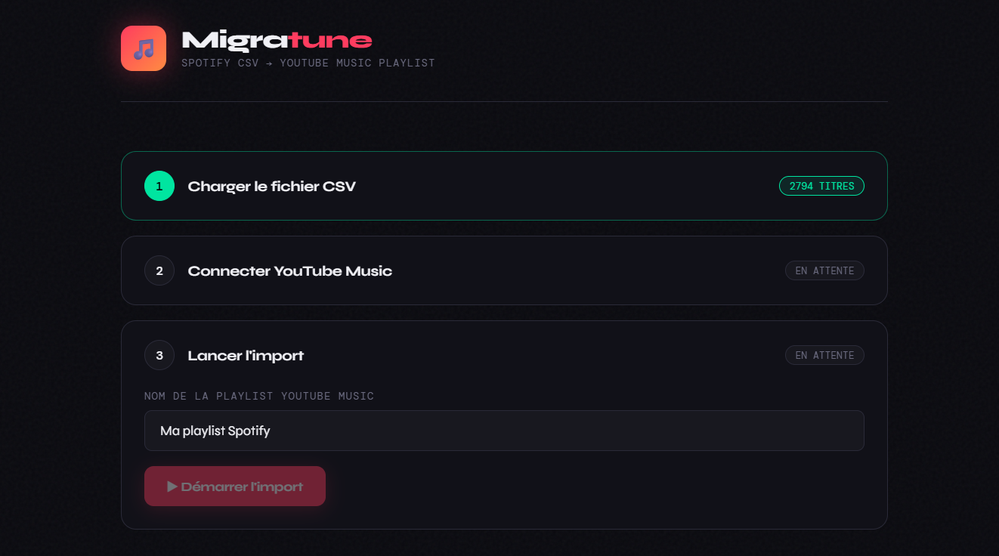

# 🎵 Migratune

> **Exporte tes playlists Spotify et importe-les dans YouTube Music en quelques minutes.**

Aucun abonnement. Aucune API key. Aucune donnée envoyée à l'extérieur.  
Tout tourne **en local sur ta machine** — c'est open source, c'est gratuit, c'est à toi.



---

## ⚡ Stack technique

| Composant         | Technologie                                    |
| ----------------- | ---------------------------------------------- |
| 🐍 Backend        | Python 3 · Flask · ytmusicapi                  |
| 🌐 Frontend       | HTML / CSS / JavaScript vanilla                |
| 🎧 Export Spotify | Script JS dans la console du navigateur        |
| 🔑 Auth YouTube   | Headers de navigateur (cookies) — zéro API key |
| 🔒 Exécution      | 100 % local — aucune donnée transmise          |

---

## 📋 Sommaire

1. [🤔 Pourquoi ce projet ?](#-pourquoi-ce-projet-)
2. [🔄 Le flux complet](#-le-flux-complet)
3. [📦 Prérequis](#-prérequis)
4. [🚀 Installation](#-installation)
5. [1️⃣ Exporter ta playlist Spotify](#1️⃣-étape-1--exporter-ta-playlist-spotify-en-csv)
6. [2️⃣ Connecter YouTube Music](#2️⃣-étape-2--connecter-ton-compte-youtube-music)
7. [3️⃣ Lancer l'import](#3️⃣-étape-3--lancer-limport)
8. [📁 Structure du projet](#-structure-du-projet)
9. [🛠️ Dépannage](#️-dépannage)
10. [⚖️ Mentions légales](#️-mentions-légales)
11. [📄 Licence](#-licence)
12. [🤝 Contribuer](#-contribuer)

---

## 🤔 Pourquoi ce projet ?

Migrer ses playlists de Spotify vers YouTube Music devrait être simple. Ce ne l'est pas :

- 💸 Les outils existants sont **payants** ou freemium avec des limites sévères
- 🔒 La plupart des méthodes "gratuites" exigent un **Spotify Premium** pour l'API officielle
- ☁️ D'autres nécessitent un **YouTube Premium** ou des credentials Google Cloud complexes
- 👁️ Les services en ligne font transiter tes données sur leurs serveurs

**Migratune contourne tout ça.** Il n'utilise ni l'API Spotify ni l'API Google — juste un export CSV depuis ton navigateur et tes cookies YouTube Music. Aucun abonnement, aucune fuite de données.

> 📱 **Complément recommandé — [Metrolist](https://github.com/metrolistgroup/metrolist)**
>
> Une fois ta playlist importée, écoute-la sur Android sans compromis. Metrolist est un client YouTube Music open source — lecture en arrière-plan, mode hors ligne, paroles synchronisées, égaliseur, Material You, zéro pub.
>
> **Migratune + Metrolist = migration complète de Spotify vers une stack 100 % libre. 🔓**

---

## 🔄 Le flux complet

```
🎵 Spotify          ⚙️ Migratune              🎶 YouTube Music
   Ta playlist  →   Export CSV + Import   →   Ta nouvelle playlist
 (console JS)       (interface locale)
```

---

## 📦 Prérequis

- 🐍 Python 3.10 ou supérieur
- 🌐 Google Chrome
- 🎶 Un compte YouTube Music actif

---

## 🚀 Installation

```bash
# 📥 Cloner le projet
git clone https://github.com/MaeRiz/Migratune.git
cd migratune

# 🐍 Créer un environnement virtuel
python -m venv venv

# ▶️ Activer l'environnement virtuel
# Sur Windows :
venv\Scripts\activate
# Sur macOS / Linux :
source venv/bin/activate

# 📦 Installer les dépendances
pip install -r requirements.txt

# 🚀 Lancer le serveur
python server.py
```

Puis ouvre **http://localhost:5000** dans ton navigateur. 🎉

---

## 1️⃣ Étape 1 — Exporter ta playlist Spotify en CSV

Le fichier `scripts/export_spotify.js` se colle dans la console du navigateur directement sur Spotify. Il scrolle ta playlist automatiquement et télécharge un CSV propre.

### 📋 Procédure

1. Ouvre **[open.spotify.com](https://open.spotify.com)** et navigue jusqu'à ta playlist
2. Laisse la page charger complètement
3. Ouvre les DevTools **F12** → onglet **Console**
4. Ouvre `scripts/export_spotify.js`, copie tout son contenu
5. Colle-le dans la console et appuie sur **Entrée**
6. Le script scrolle et affiche la progression :
    ```
    🟢 Spotify Exporter démarré
    42 titres collectés...
    127 titres collectés...
    ✓ Terminé ! 312 titres exportés dans spotify_playlist.csv
    ```
7. Le fichier **`spotify_playlist.csv`** se télécharge automatiquement ✅

### ⚙️ Ce que fait le script

- 🔍 Détecte automatiquement le conteneur de scroll
- 📜 Scrolle par blocs de 1500 px avec 700 ms de pause
- 🛑 S'arrête après 5 passes sans nouveaux titres
- 🔄 Déduplique les entrées
- 🔤 Exporte en UTF-8 avec BOM (accents préservés)

### 📄 Format du CSV produit

```csv
Titre,Artiste,Album,Date d'ajout,Durée
"Sans surprise","Georgio","Gloria","20 janv. 2026","2:49"
"Héra","Georgio","Héra","12 janv. 2026","3:56"
```

> ⚠️ **Si aucun titre n'est trouvé** : Spotify a peut-être modifié ses `data-testid`. Inspecte un titre dans les DevTools et compare avec les sélecteurs du script.

---

## 2️⃣ Étape 2 — Connecter ton compte YouTube Music

L'auth repose sur tes **headers de navigateur** — aucune API key, aucun compte développeur.

### 📋 Procédure

1. Ouvre **[music.youtube.com](https://music.youtube.com)** et connecte-toi
2. Ouvre les DevTools **F12** → onglet **Réseau**
3. Dans le filtre, tape **`search`**
4. Fais une recherche dans YouTube Music (n'importe quel artiste)
5. Clique sur la requête **`/youtubei/v1/search`**
6. Vérifie la présence de ce header dans les en-têtes de requête :
    ```
    authorization: SAPISIDHASH ...
    ```
    > 🔑 Ce header est indispensable — il identifie une requête API authentifiée.
7. Copie tous les en-têtes de requête
8. Colle-les dans le champ **"En-têtes de navigateur"** de l'interface

> 💾 Les identifiants sont sauvegardés dans `browser.json`. Tu n'auras à recommencer que si tes cookies expirent (généralement après plusieurs semaines).

---

## 3️⃣ Étape 3 — Lancer l'import

1. 📂 Charge ton `spotify_playlist.csv` (glisser-déposer ou clic)
2. 👀 Un aperçu des 5 premiers titres s'affiche
3. ✏️ Donne un nom à ta future playlist YouTube Music
4. ▶️ Clique sur **Démarrer l'import**

Les titres s'affichent en temps réel avec leur statut :

| Statut        | Signification          |
| ------------- | ---------------------- |
| ✅ trouvé     | Titre trouvé et ajouté |
| ❌ non trouvé | Aucun résultat         |
| ⚠️ sans ID    | Résultat sans videoId  |
| 🔴 erreur     | Erreur API             |

🎉 À la fin, un **lien direct** vers ta playlist YouTube Music s'affiche.

---

## 📁 Structure du projet

```
migratune/
├── 🐍 server.py               ← serveur Flask (backend)
├── 🌐 static/
│   └── index.html             ← interface web (frontend)
├── 📜 scripts/
│   └── export_spotify.js      ← script d'export console Spotify
├── 📦 requirements.txt        ← dépendances Python
├── 🔑 browser.json            ← créé auto (ne pas partager !)
└── 📖 README.md
```

---

## 🛠️ Dépannage

**❌ Aucun titre trouvé alors que la connexion a réussi**  
→ Les headers ne contiennent pas `authorization: SAPISIDHASH`. Refais l'étape 2 avec une requête `/youtubei/v1/search`.

**🔤 Caractères bizarres dans l'aperçu (é, è…)**  
→ Migratune détecte et corrige automatiquement ce problème d'encodage. Si ça persiste, ré-enregistre le CSV en UTF-8.

**🔍 Certains titres ne sont pas trouvés**  
→ Normal — certains titres Spotify ne sont pas sur YouTube Music ou ont un nom différent. Taux de réussite habituel : 85–98 %.

**⏰ Les cookies ont expiré**  
→ Supprime `browser.json`, reconnecte-toi sur music.youtube.com et recommence l'étape 2.

**⚙️ Le script Spotify ne trouve aucun titre**  
→ Spotify a peut-être mis à jour ses sélecteurs HTML. Inspecte un titre (clic droit → Inspecter) et compare les `data-testid` avec ceux du script.

---

## ⚖️ Mentions légales

**🚫 Aucune affiliation**  
Migratune n'est affilié à, sponsorisé par, ni approuvé par Spotify, Google, YouTube ou toute autre entité mentionnée. Spotify et YouTube Music sont des marques déposées appartenant à leurs propriétaires respectifs.

**👤 Usage personnel uniquement**  
Cet outil est conçu pour transférer des données auxquelles tu as légitimement accès via ton propre compte. Il n'est pas destiné à contourner des protections, accéder à des contenus sans autorisation, ni à être utilisé à des fins commerciales.

**🔓 Aucune garantie**  
Ce logiciel est fourni "tel quel", sans garantie d'aucune sorte. Les auteurs déclinent toute responsabilité pour tout dysfonctionnement, perte de données, suspension de compte ou préjudice résultant de son utilisation.

**📜 Conformité aux CGU**  
L'utilisation de ce projet peut être soumise aux conditions d'utilisation de Spotify et YouTube Music. Il appartient à l'utilisateur de s'assurer de la conformité dans sa juridiction.

**🔒 Données personnelles**  
Aucune donnée n'est collectée ou transmise. Le fichier `browser.json` contient tes cookies de session — **ne le partage jamais**.

---

## 📄 Licence

Ce projet est publié sous licence **MIT** — libre d'utilisation, de modification et de redistribution.
